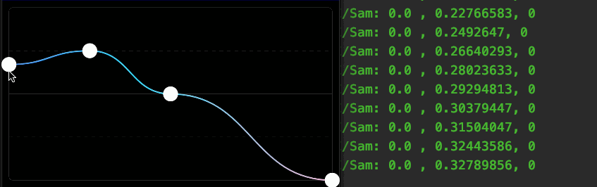

# CubicBezierView
安卓 三阶贝塞尔曲线 自定义 view


* 可以有 N 个操作点，操作点按 X 坐标排序，操作点 X 的范围为相邻点的 X 坐标或者边缘
* 操作点通过 [points] 记录，更新后需要调用 [updatePoint]
* 设置 [pointEvent] 可以监听用户操作点的更新和其它位置的更新


示例：

```kotlin
val view = CubicBezierView(context)
view.points.add(PointF(0f, 0.1f))
view.points.add(PointF(0.25f, 0.25f))
view.points.add(PointF(0.5f, 0.5f))
view.points.add(PointF(1f, 1f))
view.setBackgroundColor(Color.BLACK)
view.pointEvent = object : Event {
    override fun onEvent(
        scaleX: Float,
        scaleY: Float,
        pointIndex: Int
    ) {
        Log.i("Sam", "$scaleX , $scaleY, $pointIndex")
    }
}
view.layoutParams = FrameLayout.LayoutParams(ViewGroup.LayoutParams.MATCH_PARENT, 200.dp)
```

效果图：

